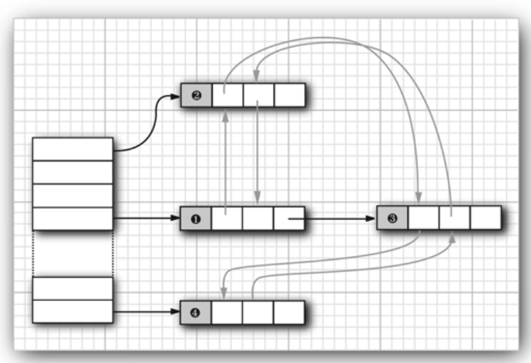

# Collections

The data structures that you choose can make a big difference when you try
to implement methods in a natural style or are concerned with performance.
Do you need to search quickly through thousands (or even millions) of sorted
items? Do you need to rapidly insert and remove elements in the middle of
an ordered sequence? Do you need to establish associations between keys
and values?

This chapter shows how the Java library can help you accomplish the tradi-
tional data structuring needed for serious programming.

## The Java Collections Framework

### Separating Collection Interfaces and Implementation

As is common with modern data structure libraries, the Java collection library
separates **interfaces** and **implementations**. Let us look at that separation with a
familiar data structure, the queue.

A queue **interface** specifies that you can add elements at the tail end of the
queue, remove them at the head, and find out how many elements are in
the queue. You use a queue when you need to collect objects and retrieve
them in a “first in, first out” fashion.

The interface tells you nothing about how the queue is implemented. Of the
two common implementations of a queue, one uses a “circular array” and
one uses a linked list. Each implementation can be expressed by a class that implements the Queue
interface.

When you use a queue in your program, you don’t need to know which implementation is 
actually used once the collection has been constructed. Therefore, it makes sense 
to use the concrete class only when you construct the collection object. **Use the 
interface type to hold the collection reference**.

```java
// CircularArrayQueue is not a real class 
Queue<Customer> expressLane = new CircularArrayQueue<>(100);
expressLane.add(new Customer("Harry"));
```

With this approach, if you change your mind, you can easily use a different
implementation.

```java
// LinkedListQueue is not a real class
Queue<Customer> expressLane = new LinkedListQueue<>();
expressLane.add(new Customer("Harry"));
```

When you study the API documentation, you will find another set of classes
whose name begins with Abstract, such as AbstractQueue. These classes are
intended for library implementors. In the (perhaps unlikely) event that you
want to implement your own queue class, you will find it easier to extend
AbstractQueue than to implement all the methods of the Queue interface.

### The Collection Interface

The fundamental interface for collection classes in the Java library is the
Collection interface. The interface has two fundamental methods:

```java
public interface Collection<E> {
    boolean add(E element);
    Iterator<E> iterator();
    . . .
}
```

There are several methods in addition to these two; we will discuss them
later.

The add method adds an element to the collection. The add method returns
true if adding the element actually changes the collection, and false if the col-
lection is unchanged. For example, if you try to add an object to a set and
the object is already present, the add request has no effect because sets reject
duplicates.

The iterator method returns an object that implements the Iterator interface.
You can use the iterator object to visit the elements in the collection one by
one.

### Iterators

The Iterator interface has four methods:

```java
public interface Iterator<E> {
    E next();
    boolean hasNext();
    void remove();
    default void forEachRemaining(Consumer<? super E> action);
}
```

- By repeatedly calling the **next method**, you can visit the elements from the
  collection one by one. However, if you reach the end of the collection, the
  next method throws a NoSuchElementException.
- You need to call the **hasNext method** before calling next. That method returns true if the iterator object still
  has more elements to visit.
- Instead of writing a loop, you can call the forEachRemaining method with a
  lambda expression that consumes an element. The lambda expression is
  invoked with each element of the iterator, until there are none left.

    ```java
    iterator.forEachRemaining(element -> do something with element);
    ```
- The remove method of the Iterator interface removes the element that was re-
  turned by the last call to next. In many situations, that makes sense—you need
  to see the element before you can decide that it is the one that should be
  removed. But if you want to remove an element in a particular position, you

  More importantly, there is a dependency between the calls to the next and
  remove methods. It is illegal to call remove if it wasn’t preceded by a call to next.  

---

The compiler simply translates the “for each” loop into a loop with an iterator.

The “for each” loop works with any object that implements the Iterable
interface, an interface with a single abstract method:

```java
public interface Iterable<E> {
    Iterator<E> iterator();
    . . .
}
```

The Collection interface extends the Iterable interface. Therefore, you can use
the “for each” loop with any collection in the standard library

---

### Generic Utility Methods

The Collection and Iterator interfaces are generic, which means you can write
utility methods that operate on any kind of collection. For example, here is
a generic method that tests whether an arbitrary collection contains a given
element:

```java
public static <E> boolean contains(Collection<E> c, Object obj) {
    for (E element : c)
        if (element.equals(obj))
            return true;
    return false;
}
```

The designers of the Java library decided that some of these utility methods
are so useful that the library should make them available. That way, library
users don’t have to keep reinventing the wheel. The contains method is one
such method.

In fact, the Collection interface declares quite a few useful methods that all
implementing classes must supply. Among them are

```java
int size()
boolean isEmpty()
boolean contains(Object obj)
boolean containsAll(Collection<?> c)
boolean equals(Object other)
boolean addAll(Collection<? extends E> from)
boolean remove(Object obj)
boolean removeAll(Collection<?> c)
void clear()
boolean retainAll(Collection<?> c)
Object[] toArray()
<T> T[] toArray(T[] arrayToFill)
```

Of course, it is a bother if every class that implements the Collection interface
has to supply so many routine methods. To make life easier for implementors,
the library supplies a class AbstractCollection that leaves the fundamental methods
size and iterator abstract but implements the routine methods in terms of them.

A concrete collection class can now extend the AbstractCollection class. It is up
to the concrete collection class to supply an iterator method, but the contains
method has been taken care of by the AbstractCollection superclass. However,
if the subclass has a more efficient way of implementing contains, it is free to
do so.

## Interfaces in the Collections Framework

The Java collections framework defines a number of interfaces for different
types of collections


- There are two fundamental interfaces for collections: Collection and Map. As you
  already saw, you insert elements into a collection with a method 

    ```java
    boolean add (E element)
    ```
    
    However, maps hold key/value pairs, and you use the put method to
    insert them:
    
    ```java
    V put(K key, V value)
    ```
    
    To read elements from a collection, visit them with an iterator. However, you
    can read values from a map with the get method:
    
    ```java
    V get(K key)
    ```

- A List is an **ordered collection**. Elements are added into a particular position in
  the container. An element can be accessed in two ways: by an iterator or by
  an integer index. The latter is called random access because elements can be
  visited in any order. In contrast, when using an iterator, one must visit them
  sequentially.

    The List interface defines several methods for random access:
    
    ```java
    void add(int index, E element)
    void remove(int index)
    E get(int index)
    E set(int index, E element)
    ```
    
    The ListIterator interface is a subinterface of Iterator. It defines a method for
    adding an element before the iterator position:

    ```java
    void add(E element)
    ```

    Frankly, this aspect of the collections framework is poorly designed. In practice,
    there are two kinds of ordered collections, with very different performance
    tradeoffs. An ordered collection that is backed by an array has fast random
    access, and it makes sense to use the List methods with an integer index. In
    contrast, a linked list, while also ordered, has slow random access, and it is
    best traversed with an iterator. It would have been an easy matter to provide
    two interfaces.


- The **Set interface** is identical to the Collection interface, but the behavior of the
  methods is more tightly defined. The add method of a set should reject duplicates. The equals method of a set should be defined so that two sets are
  identical if they have the same elements, but not necessarily in the same order.
  The hashCode method should be defined so that two sets with the same elements
  yield the same hash code.

    Why make a separate interface if the method signatures are the same?
    Conceptually, not all collections are sets. Making a Set interface enables
    programmers to write methods that accept only sets.

- The SortedSet and SortedMap interfaces expose the comparator object used for
  sorting, and they define methods to obtain views of subsets of the collections.
- Finally, Java 6 introduced interfaces NavigableSet and NavigableMap that contain
  additional methods for searching and traversal in sorted sets and maps.

## Concrete Collections

All classes in the image implement the Collection interface, with the exception of the classes with names
ending in Map. Those classes implement the Map interface instead.


### Linked Lists

Arrays and array lists suffer from a major
drawback. Removing an element from the middle of an array is expensive
since all array elements beyond the removed one must be moved toward the
beginning of the array. The same is true for inserting elements
in the middle.

Another well-known data structure, the linked list, solves this problem. Where
an array stores object references in consecutive memory locations, a linked
list stores each object in a separate link. Each link also stores a reference to
the next link in the sequence. In the Java programming language, all linked
lists are actually **doubly linked**; that is, each link also stores a reference to its
predecessor.

```java
var staff = new LinkedList<String>();
staff.add("Amy");
staff.add("Bob");
staff.add("Carl");
Iterator<String> iter = staff.iterator();
String first = iter.next(); // visit first element
String second = iter.next(); // visit second element
iter.remove(); // remove last visited element
```

There is, however, an important difference between linked lists and generic
collections. A linked list is an ordered collection in which the position of the
objects matters. The LinkedList.add method adds the object to the end of the list.

But you will often want to add objects somewhere in the middle of a list.
This position-dependent add method is the responsibility of an iterator, since
iterators describe positions in collections. Using iterators to add elements
makes sense only for collections that have a natural ordering. There is no add method in the Iterator inter-
face. Instead, the collections library supplies a subinterface ListIterator that
contains an add method:

```java
interface ListIterator<E> extends Iterator<E> {
    void add(E element);
    . . .
}
```

In addition, the ListIterator interface has two methods that you can use for
traversing a list backwards.

```java
E previous()
boolean hasPrevious()
```

Like the next method, the previous method returns the object that it skipped over.

The listIterator method of the LinkedList class returns an iterator object that
implements the ListIterator interface.

The add method adds the new element before the iterator position.

```java
var staff = new LinkedList<String>();
staff.add("Amy");
staff.add("Bob");
staff.add("Carl");
ListIterator<String> iter = staff.listIterator();
iter.next(); // skip past first element
iter.add("Juliet");
```

Finally, a set method replaces the last element, returned by a call to next or
previous, with a new element.

```java
ListIterator<String> iter = list.listIterator();
String oldValue = iter.next(); // returns first element
iter.set(newValue); // sets first element to newValue
```

As you might imagine, if an iterator traverses a collection while another iterator is modifying it, confusing situations can occur. For example, suppose an
iterator points before an element that another iterator has just removed.
The iterator is now invalid and should no longer be used. The linked list iterators have been designed to detect such modifications. If an iterator finds
that its collection has been modified by another iterator or by a method
of the collection itself, it throws a ConcurrentModificationException.

```java
List<String> list = . . .;
ListIterator<String> iter1 = list.listIterator();
ListIterator<String> iter2 = list.listIterator();
iter1.next();
iter1.remove();
iter2.next(); // throws ConcurrentModificationException
```

To avoid concurrent modification exceptions, follow this simple rule: You
can attach as many iterators to a collection as you like, provided that all of
them are only readers. Alternatively, you can attach a single iterator that can
both read and write.

Many other useful methods for operating on linked lists are declared
in the Collection interface. These are, for the most part, implemented in the
AbstractCollection superclass of the LinkedList class.

We recommend that you simply stay away from all methods that use an integer
index to denote a position in a linked list. If you want random access into a
collection, use an array or ArrayList, not a linked list.

### Array Lists

The List interface describes an ordered collection in which the
position of elements matters. There are two protocols for visiting the elements:
through an iterator and by random access with methods get and set. The latter
is not appropriate for linked lists, but of course get and set make a lot of sense
for arrays.

The collections library supplies the familiar ArrayList class that
also implements the List interface. An ArrayList encapsulates a dynamically
reallocated array of objects.

### Hash Sets

#### Hash Table context

If you don’t care about the ordering of the elements, there are data 
structures that let you find elements much faster. The drawback is that 
those data structures give you no control over the order in which the 
elements appear.

A well-known data structure for finding objects quickly is the **hash table**. A
hash table computes an integer, called the hash code, for each object. A hash code is somehow derived from the 
instance fields of an object, 
preferably in such a way that objects with different data yield different 
codes.

If you define your own classes, you are responsible for implementing your
own hashCode method. Your implementation needs to be compatible with the 
equals method: If a.equals(b), then a and b must have the same hash code.

In Java, hash tables are implemented as arrays of linked lists. Each list is
called a bucket. . If the hash codes are reasonably randomly distributed and the
number of buckets is large enough, only a few comparisons should be
necessary to find an object.

> As of Java 8, the buckets change from linked lists into balanced binary
trees when they get full. This improves performance if a hash function was
poorly chosen and yields many collisions, or if malicious code tries to flood a
hash table with many values that have identical hash codes.

If you want more control over the performance of the hash table, you can
specify the initial bucket count. The bucket count gives the number of buckets
used to collect objects with identical hash values. If too many elements are
inserted into a hash table, the number of collisions increases and retrieval
performance suffers.

If you know how many elements, approximately, will eventually be in the
table, you can set the bucket count. Typically, you should set it to somewhere
between 75% and 150% of the expected element count.

Of course, you do not always know how many elements you need to store,
or your initial guess may be too low. If the hash table gets too full, it needs
to be rehashed. To rehash the table, a table with more buckets is created, all
elements are inserted into the new table, and the original table is discarded.
The load factor determines when a hash table is rehashed. For example, if the
load factor is 0.75 (which is the default) and the table is more than 75% full, it
is automatically rehashed with twice as many buckets. For most applications,
it is reasonable to leave the load factor at 0.75.

#### HashSet

Hash tables can be used to implement several important data structures. The
simplest among them is the **set type**. A set is a collection of elements without
duplicates. The add method of a set first tries to find the object to be added,
and adds it only if it is not yet present.

The Java collections library supplies a **HashSet class** that implements a set based
on a hash table. You add elements with the add method. The contains method
is redefined to make a fast lookup to see if an element is already present in
the set. It checks only the elements in one bucket and not all elements in the
collection.

The hash set iterator visits all buckets in turn. Since hashing scatters the elements around in the table, they are visited in a seemingly random order. You
would only use a HashSet if you don’t care about the ordering of the elements
in the collection.

### TreeSet

The TreeSet class is similar to the hash set, with one added improvement. A
tree set is a sorted collection.
You insert elements into the collection in any
order. When you iterate through the collection, the values are automatically
presented in sorted order.

As the name of the
class suggests, the sorting is accomplished by a tree data structure. Every time an element is added to a tree, it is placed into its proper sorting
position. Therefore, the iterator always visits the elements in sorted order.

Adding an element to a tree is slower than adding it to a hash table. But it is still much faster than checking 
for duplicates in an array or linked list. If the tree contains n elements, then an average
of log2 n comparisons are required to find the correct position for the new
element.

> In order to use a tree set, you must be able to compare the elements.
The elements must implement the Comparable interface, or you must supply a
Comparator when constructing the set.

Any two elements must be
comparable, and the comparison can only be zero if the elements are equal.

> As of Java 6, the TreeSet class implements the NavigableSet interface. That
interface adds several convenient methods for locating elements and for
backward traversal.

### Queues and Deques

A queue lets you efficiently add elements at the tail
and remove elements from the head. A double-ended queue, or deque, lets
you efficiently add or remove elements at the head and tail.

Adding elements
in the middle is not supported. Java 6 introduced a Deque interface. It is 
implemented by the ArrayDeque and LinkedList classes, both of which provide 
deques whose size grows as needed.

### Priority Queues

A priority queue retrieves elements in sorted order after they were inserted
in arbitrary order. That is, whenever you call the remove method, you get the
smallest element currently in the priority queue.

Just like a TreeSet, a priority queue can either hold elements of a class that
implements the Comparable interface or a Comparator object you supply in the
constructor.

A typical use for a priority queue is job scheduling. Each job has a priority.
Jobs are added in random order. Whenever a new job can be started, the
highest priority job is removed from the queue. (Since it is traditional for
priority 1 to be the “highest” priority, the remove operation yields the minimum
element.)

## Maps

A map stores key/value pairs. You can find a value if
you provide the key. For example, you may store a table of employee records,
where the keys are the employee IDs and the values are Employee objects.

### Basic Maps Operations

The Java library supplies two general-purpose implementations for maps:
HashMap and TreeMap. Both classes implement the Map interface. A hash map hashes the keys, and a tree map uses an ordering on the keys
to organize them in a search tree. The hash or comparison function is applied
only to the keys. The values associated with the keys are not hashed or
compared.

```java
var staff = new HashMap<String, Employee>(); // HashMap implements Map
var harry = new Employee("Harry Hacker");
staff.put("987-98-9996", harry);
. . .
```

To retrieve an object, you must use (and, therefore, remember) the key.

If no information is stored in the map with the particular key specified, get
returns null. The null return value can be inconvenient. Sometimes, you have a good default
that can be used for keys that are not present in the map. Then use the
getOrDefault method.

```java
Map<String, Integer> scores = . . .;
int score = scores.getOrDefault(id, 0); // gets 0 if the id is not present
```

Keys must be unique. You cannot store two values with the same key. If you
call the put method twice with the same key, the second value replaces the
first one. In fact, put returns the previous value associated with its key
parameter.

The easiest way of iterating over the keys and values of a map is the forEach
method. Provide a lambda expression that receives a key and a value. That
expression is invoked for each map entry in turn.

```java
scores.forEach((k, v) ->
    System.out.println("key=" + k + ", value=" + v));
```

### Updating Map Entries

A tricky part of dealing with maps is updating an entry. Normally, you get
the old value associated with a key, update it, and put back the updated value.
But you have to worry about the special case of the first occurrence of a key.

```java
counts.put(word, counts.get(word) + 1);
```

That works, except in the case when word is encountered for the first time.
Then get returns null, and a NullPointerException occurs. Simply use getOrDefault:

```java
counts.put(word, counts.getOrDefault(word, 0) + 1);
```

But you can do better than that. The merge method simplifies this common
operation. The call

```java
counts.merge(word, 1, Integer::sum);
```

associates word with 1 if the key wasn’t previously present, and otherwise
combines the previous value and 1, using the Integer::sum function.


### Map Views

The collections framework does not consider a map itself as a collection.
(Other frameworks for data structures consider a map as a collection of
key/value pairs, or as a collection of values indexed by the keys.) However,
you can obtain views of the map—objects that implement the Collection interface
or one of its subinterfaces.

There are three views: the set of keys, the collection of values (which is not
a set), and the set of key/value pairs. The keys and key/value pairs form a
set because there can be only one copy of a key in a map. The methods

```java
Set<K> keySet()
Collection<V> values()
Set<Map.Entry<K, V>> entrySet()
```

return these three views. (The elements of the entry set are objects of a class
implementing the Map.Entry interface.)

If you want to look at both keys and values, you can avoid value lookups by
enumerating the entries. Use the following code skeleton:

```java
for (Map.Entry<String, Employee> entry : staff.entrySet()) {
    String k = entry.getKey();
    Employee v = entry.getValue();
    do something with k, v
}
```

If you invoke the remove method of the iterator on the key set view, you actu-
ally remove the key and its associated value from the map. However, you cannot
add an element to the key set view. It makes no sense to add a key without
also adding a value. If you try to invoke the add method, it throws an
UnsupportedOperationException. The entry set view has the same restriction, even
though it would make conceptual sense to add a new key/value pair.


### Weak Hash Maps

The WeakHashMap class was designed to solve an interesting problem. What hap-
pens with a value whose key is no longer used anywhere in your program?
Suppose the last reference to a key has gone away. Then, there is no longer
any way to refer to the value object. But, as no part of the program has the
key any more, the key/value pair cannot be removed from the map. Why
can’t the garbage collector remove it? Isn’t it the job of the garbage collector
to remove unused objects?

This data structure cooperates with the garbage collector to remove 
key/value pairs when the only reference to the key is the one from the 
hash table entry.


### Linked Hash Sets and Maps

The LinkedHashSet and LinkedHashMap classes remember in which order you inserted
items. That way, you can avoid the seemingly random order of items in a
hash table. As entries are inserted into the table, they are joined in a doubly
linked list




A linked hash map can alternatively use access order, not insertion order, to
iterate through the map entries. Every time you call get or put, the affected
entry is removed from its current position and placed at the end of the linked
list of entries. (Only the position in the linked list of entries is affected, not
the hash table bucket. An entry always stays in the bucket that corresponds
to the hash code of the key). Access order is useful for implementing a “least recently used” discipline for
a cache.

### Identity Hash Maps

The IdentityHashMap has a quite specialized purpose. Here, the hash values
for the keys should not be computed by the hashCode method but by the
System.identityHashCode method. That’s the method that Object.hashCode uses to
compute a hash code from the object’s memory address. Also, for comparison
of objects, the IdentityHashMap uses ==, not equals.

In other words, different key objects are considered distinct even if they have
equal contents. This class is useful for implementing object traversal algorithms, 
such as object serialization, in which you want to keep track of which
objects have already been traversed.

## Views and Wrappers

You might think it is overkill to have lots
of interfaces and abstract classes to implement a modest number of concrete
collection classes. However, these figures don’t tell the whole story. By using
views, you can obtain other objects that implement the Collection or Map inter-
faces. You saw one example of this with the keySet method of the map classes.
At first glance, it appears as if the method creates a new set, fills it with all the
keys of the map, and returns it. However, that is not the case. Instead,
the keySet method returns an object of a class that implements the Set interface
and whose methods manipulate the original map. Such a collection is called
a view.

### Small Collections

Java 9 introduces static methods yielding a set or list with given elements,
and a map with given key/value pairs.

```java
List<String> names = List.of("Peter", "Paul", "Mary");
Set<Integer> numbers = Set.of(2, 3, 5);
```

yield a list and a set with three elements. For a map, you specify the keys
and values, like this:

```java
Map<String, Integer> scores = Map.of("Peter", 2, "Paul", 3, "Mary", 5);
```

The elements, keys, or values may not be null.

The List and Set interfaces have eleven of methods with zero to ten arguments,
and an of method with a variable number of arguments. The specializations
are provided for efficiency.

For the Map interface, it is not possible to provide a version with variable argu-
ments since the argument types alternate between the key and value types.
There is a static method ofEntries that accepts an arbitrary number of
Map.Entry<K, V> objects, which you can create with the static entry method.

```java
import static java.util.Map.*;
. . .
Map<String, Integer> scores = ofEntries(
    entry("Peter", 2),
    entry("Paul", 3),
    entry("Mary", 5)
);
```

The of and ofEntries methods produce objects of classes that have an instance
variable for each element, or that are backed by an array.

These collection objects are unmodifiable. Any attempt to change their contents
results in an UnsupportedOperationException.

### Subranges

You can form subrange views for a number of collections. For example, sup-
pose you have a list staff and want to extract elements 10 to 19. Use the subList
method to obtain a view into the subrange of the list:

```java
List<Employee> group2 = staff.subList(10, 20);
```

The first index is inclusive, the second exclusive.

You can apply any operations to the subrange, and they automatically reflect
the entire list.

For sorted sets and maps, you use the sort order, not the element position,
to form subranges. The SortedSet interface declares three methods:

```java
SortedSet<E> subSet(E from, E to)
SortedSet<E> headSet(E to)
SortedSet<E> tailSet(E from)
```

For sorted maps, the similar methods

```java
SortedMap<K, V> subMap(K from, K to)
SortedMap<K, V> headMap(K to)
SortedMap<K, V> tailMap(K from) 
```

return views into the maps consisting of all entries in which the keys fall into
the specified ranges.

The NavigableSet interface introduced in Java 6 gives more control over these
subrange operations. You can specify whether the bounds are included:

```java
NavigableSet<E> subSet(E from, boolean fromInclusive, E to, boolean toInclusive)
NavigableSet<E> headSet(E to, boolean toInclusive)
NavigableSet<E> tailSet(E from, boolean fromInclusive)
```

### Unmodifiable Views

The Collections class has methods that produce unmodifiable views of collections.
These views add a runtime check to an existing collection. If an attempt to
modify the collection is detected, an exception is thrown and the collection
remains untouched.

You obtain unmodifiable views by eight methods:

```java
Collections.unmodifiableCollection
Collections.unmodifiableList
Collections.unmodifiableSet
Collections.unmodifiableSortedSet
Collections.unmodifiableNavigableSet
Collections.unmodifiableMap
Collections.unmodifiableSortedMap
Collections.unmodifiableNavigableMap
```

Each method is defined to work on an interface. For example, Collections
.unmodifiableList works with an ArrayList, a LinkedList, or any other class that
implements the List interface.

The views wrap the interface and not the actual collection object, so you only
have access to those methods that are defined in the interface. For example,
the LinkedList class has convenience methods, addFirst and addLast, that are not
part of the List interface. These methods are not accessible through the
unmodifiable view.

### Checked Views

Checked views are intended as debugging support for a problem that can
occur with generic types. It is actually possible to
smuggle elements of the wrong type into a generic collection. A checked view can 
detect this problem.

## Algorithms

In addition to implementing collection classes, the Java collections framework
also provides a number of useful algorithms.

### Sorting ang Shuffling

- The sort method in the Collections class sorts a collection that implements the
List interface.

```java
var staff = new LinkedList<String>();
fill collection
Collections.sort(staff);
```

This method assumes that the list elements implement the Comparable interface.
If you want to sort the list in some other way, you can use the sort method
of the List interface and pass a Comparator object. Here is how you can sort a
list of employees by salary:

```java
staff.sort(Comparator.comparingDouble(Employee::getSalary));
```

If you want to sort a list in descending order, use the static convenience method
Comparator.reverseOrder(). It returns a comparator that returns b.compareTo(a).

```java
staff.sort(Comparator.reverseOrder())

staff.sort(Comparator.comparingDouble(Employee::getSalary).reversed())
```

The sort algorithm used in the collections library is a bit slower than Quick-
Sort, the traditional choice for a general-purpose sorting algorithm. However,
it has one major advantage: It is stable, that is, it doesn’t switch equal elements.

Why do you care about the order of equal elements? Here is a common scenario. 
Suppose you have an employee list that you already sorted by name.
Now you sort by salary. What happens to employees with equal salary? With
a stable sort, the ordering by name is preserved. In other words, the outcome
is a list that is sorted first by salary, then by name.

- The Collections class has an algorithm shuffle that does the opposite of sorting—it
  randomly permutes the order of the elements in a list. For example:

```java
ArrayList<Card> cards = . . .;
Collections.shuffle(cards);
```

### Binary Search

The binarySearch of the Collections class implements this algorithm. Note that the
collection must already be sorted, or the algorithm will return the wrong answer.

If the collection is not sorted by the compareTo element of the Comparable interface,
supply a comparator object as well.

```java
i = Collections.binarySearch(c, element);
i = Collections.binarySearch(c, element, comparator);
```

A non-negative return value from the binarySearch method denotes the index
of the matching object.

If the value is negative, then there is no matching element. However,
you can use the return value to compute the location where you should insert
element into the collection to keep it sorted. The insertion location is

```java
insertionPoint = -i - 1;
```

To be worthwhile, binary search requires random access. If you have to iterate
one by one through half of a linked list to find the middle element, you have
lost all advantage of the binary search. Therefore, the binarySearch algorithm
reverts to a linear search if you give it a linked list.

### Simple algorithms

The Collections class contains several simple but useful algorithms. Among
them is finding the maximum value of a collection. Others include copying 
elements from one list to another, filling a container with a constant 
value, and reversing a list.

We like the
algorithms because they make life easier for the programmer reading the code.

The default methods Collection.removeIf and List.replaceAll that are just a bit more
complex. You provide a lambda expression to test or transform elements.

### Bulk Operations

There are several operations that copy or remove elements “in bulk.” The call

```java
coll1.removeAll(coll2);
```

removes all elements from coll1 that are present in coll2. Conversely,

```java
coll1.retainAll(coll2);
```

removes all elements from coll1 that are not present in coll2.

You can carry this idea further and apply a bulk operation to a view. By using a subrange view, you can 
restrict bulk operations to sublists and
subsets.

### Comverting between Collections and Arrays

If you have an array that you need to turn into a collection, the List.of wrapper
serves this purpose. For example:

```java
String[] values = . . .;
var staff = new HashSet<>(List.of(values));
```

Obtaining an array from a collection is a bit trickier. Of course, you can use
the toArray method. 

The array returned by the toArray method was created as an Object[] array, and
you cannot change its type. Instead, use a variant of the toArray method
and give it an array of length 0 of the type that you’d like. The returned array
is then created as the same array type:

```java
Object[] values = staff.toArray();
String[] values = staff.toArray(new String[0]);
```