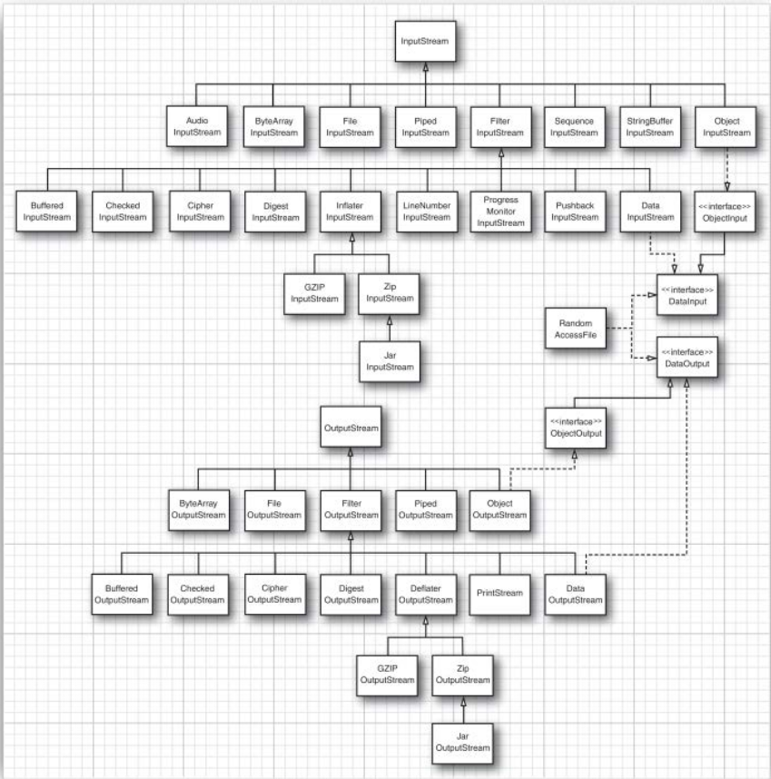
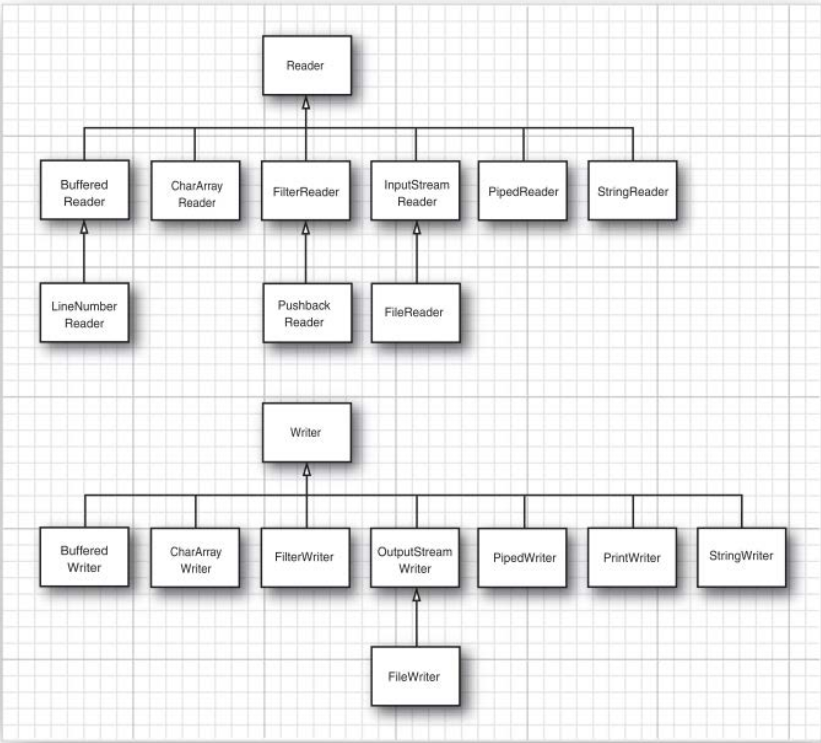
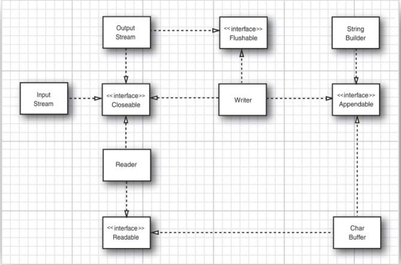
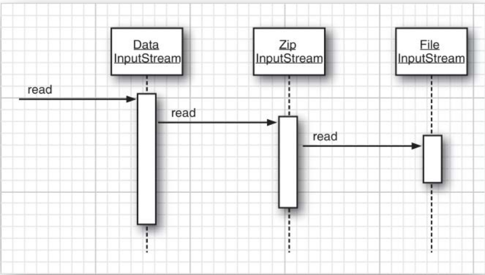

# Input/Output Streams

In the Java API, an object from which we can read a sequence of bytes is called
an **input stream**. An object to which we can write a sequence of bytes is called an
**output stream**. These sources and destinations of byte sequences can be and often
are files, but they can also be network connections and even blocks of memory.

The abstract classes InputStream and OutputStream form the basis for a hierarchy of
input/output (I/O) classes.

There are, a separate hierarchy that provides classes for processing Unicode characters 
that inherit from the abstract Reader and Writer classes.

## Reading and Writing Bytes

The InputStream class has an abstract method:

```java
   abstract int read()
  ```

This method reads one byte and returns the byte that was read, or -1 if it encoun-
ters the end of the input source. The designer of a concrete input stream class
overrides this method to provide useful functionality. For example, in the
FileInputStream class, this method reads one byte from a file. System.in is a predefined
object of a subclass of InputStream that allows you to read information from “standard
input,” that is, the console or a redirected file.

Similarly, the OutputStream class defines the abstract method

```java
   abstract void write(int b)
```

which writes one byte to an output location.

Both the read and write methods block until the byte is actually read or written. This
means that if the input stream cannot immediately be accessed (usually because
of a busy network connection), the current thread blocks. This gives other threads
the chance to do useful work while the method is waiting for the input stream to
become available again.

The available method lets you check the number of bytes that are currently available
for reading. This means a fragment like the following is unlikely to block:

```java
int bytesAvailable = in.available();
if (bytesAvailable > 0) {
    byte[] data = new byte[bytesAvailable];
    in.read(data);
}
```

When you have finished reading or writing to an input/output stream, close it
by calling the close method. This call frees up the operating system resources that
are in limited supply. If an application opens too many input/output streams
without closing them, system resources can become depleted.

Closing an output
stream also flushes the buffer used for the output stream: Any bytes that were
temporarily placed in a buffer so that they could be delivered as a larger packet
are sent off. In particular, if you do not close a file, the last packet of bytes might
never be delivered. You can also manually flush the output with the flush method.

Instead of working with bytes, you can use one of many input/output stream
classes derived from the basic InputStream and OutputStream classes.

## The Complete Stream Zoo

Java has a whole zoo of more than 60 (!) different input/output stream types.

There are separate hierarchies for classes that process bytes and characters. As
you saw, the InputStream and OutputStream classes let you read and write individual
bytes and arrays of bytes. These classes form the basis of the hierarchy. To read 
and write strings and numbers, you need more capable subclasses. For example, 
DataInputStream and DataOutputStream let you read and write all the
primitive Java types in binary format. Finally, there are input/output streams
that do other useful stuff.

For Unicode text, on the other hand, you can use subclasses of the abstract classes
Reader and Writer. The basic methods of the Reader and Writer classes
are similar to those of InputStream and OutputStream.

There are four additional interfaces: Closeable, Flushable, 
Readable, and Appendable. The first two interfaces are very simple, with methods:

```java
void close() throws IOException
void flush()
```

respectively. The classes InputStream, OutputStream, Reader, and Writer all implement the
Closeable interface. OutputStream and Writer implement the Flushable interface.
The Readable interface has a single method:

```java
int read(CharBuffer cb)
```

The Appendable interface has two methods for appending single characters and
character sequences:

```java
Appendable append(char c)
Appendable append(CharSequence s)
```

Of the input/output stream classes, only Writer implements Appendable.





## Combining Input/Output Stream Filters

FileInputStream and FileOutputStream give you input and output streams attached to a
disk file. You need to pass the file name or full path name of the file to the
constructor. For example,

```java
FileInputStream fin = new FileInputStream("employee.dat");
```

looks in the user directory for a file named employee.dat.

Like the abstract InputStream and OutputStream classes, these classes only support
reading and writing at the byte level. That is, we can only read bytes and byte
arrays from the object fin.

```java
byte b = (byte) fin.read();
```

Java uses a clever mechanism to separate two kinds of responsibilities. Some input
streams (such as the FileInputStream and the input stream returned by the openStream
method of the URL class) can retrieve bytes from files and other more exotic loca-
tions. Other input streams (such as the DataInputStream) can assemble bytes into more
useful data types. The Java programmer has to combine the two. For example, to
be able to read numbers from a file, first create a FileInputStream and then pass it to
the constructor of a DataInputStream.

```java
FileInputStream fin = new FileInputStream("employee.dat");
DataInputStream din = new DataInputStream(fin);
double x = din.readDouble();
```

If you look at the stream hierarchy picture again, you can see the classes 
FilterInputStream and FilterOutputStream. The subclasses of these classes 
are used to add capabilities to input/output streams that process bytes.

You can add multiple capabilities by nesting the filters. For example, by default,
input streams are not buffered. That is, every call to read asks the operating system
to dole out yet another byte. It is more efficient to request blocks of data instead
and store them in a buffer. If you want buffering and the data input methods for
a file, you need to use the following rather monstrous sequence of constructors:

```java
DataInputStream din = new DataInputStream(
        new BufferedInputStream(
                new FileInputStream("employee.dat")));
```

Of course, in the input/output libraries of other programming languages, niceties
such as buffering and lookahead are automatically taken care of, so it is a bit of
a hassle to resort, in Java, to combining stream filters. However, the ability to mix
and match filter classes to construct truly useful sequences of input/output
streams does give you an immense amount of flexibility. For example, you can
read numbers from a compressed ZIP file by using the following sequence of input
streams:

```java
ZipInputStream zin = new ZipInputStream(new FileInputStream("employee.zip"));
DataInputStream din = new DataInputStream(zin);
```



# Text Input and Output

When saving data, you have the choice between binary and text formats. For 
example, if the integer 1234 is saved in binary, it is written as the sequence of bytes
00 00 04 D2 (in hexadecimal notation). In text format, it is saved as the string "1234".
Although binary I/O is fast and efficient, it is not easily readable by humans.

When saving text strings, you need to consider the character encoding. In the UTF-16
encoding that Java uses internally, the string "José" is encoded as 00 4A 00 6F 00 73 00
E9 (in hex). However, many programs expect that text files are encoded in a 
different encoding. In UTF-8, the encoding most commonly used on the Internet,
the string would be written as 4A 6F 73 C3 A9, without the zero bytes for the first
three letters and with two bytes for the é character.

The OutputStreamWriter class turns an output stream of Unicode code units into a
stream of bytes, using a chosen character encoding. Conversely, the InputStreamReader
class turns an input stream that contains bytes (specifying characters in some
character encoding) into a reader that emits Unicode code units.

You should always choose a specific encoding in
the constructor for the InputStreamReader, for example:

```java
Reader in = 
        new InputStreamReader(new FileInputStream("data.txt"), StandardCharsets.UTF_8);
```

## How to Write Text Output

For text output, use a PrintWriter. That class has methods to print strings and
numbers in text format. There is a convenience constructor for printing to a file.

```java
PrintWriter out = new PrintWriter("employee.txt", "UTF-8");
```

To write to a print writer, use the same print, println, and printf methods that you
used with System.out. You can use these methods to print numbers (int, short, long,
float, double), characters, boolean values, strings, and objects.

If the writer is set to autoflush mode, all characters in the buffer are sent to their
destination whenever println is called. (Print writers are always buffered.) By de-
fault, autoflushing is not enabled. You can enable or disable autoflushing by using
the PrintWriter(Writer writer, boolean autoFlush) constructor:

```java
PrintWriter out = new PrintWriter(
    new OutputStreamWriter(
        new FileOutputStream("employee.txt"), "UTF-8"),
    true); // autoflush
```

## How To Read Text Input

The easiest way to process arbitrary text is the Scanner class that we used extensively
in Volume I. You can construct a Scanner from any input stream.

Alternatively, you can read a short text file into a string like this:

```java
String content = new String(Files.readAllBytes(path), charset);
```

But if you want the file as a sequence of lines, call

```java
List<String> lines = Files.readAllLines(path, charset);
```

If the file is large, process the lines lazily as a Stream<String>:

```java
try (Stream<String> lines = Files.lines(path, charset))
{
    ...
}
```

In early versions of Java, the only game in town for processing text input was the
BufferedReader class. Its readLine method yields a line of text, or null when no more
input is available. A typical input loop looks like this:

```java
InputStream inputStream = . . .;
try (BufferedReader in = 
        new BufferedReader(new InputStreamReader(inputStream,StandardCharsets.UTF_8)))
{
    String line;
    while ((line = in.readLine()) != null)
    {
        do something with line
    }
}
```

Nowadays, the BufferedReader class also has a lines method that yields a Stream<String>.
However, unlike a Scanner, a BufferedReader has no methods for reading numbers.

## Character Encodings

Input and output streams are for sequences of bytes, but in many cases you will
work with texts that is, sequences of characters. It then matters how characters
are encoded into bytes.

Java uses the Unicode standard for characters. Each character or “code point”
has a 21-bit integer number. There are different character encodings—methods for
packaging those 21-bit numbers into bytes.

The most common encoding is UTF-8, which encodes each Unicode code point
into a sequence of one to four bytes. UTF-8 has the advantage that
the characters of the traditional ASCII character set, which contains all characters
used in English, only take up one byte each.

Another common encoding is UTF-16, which encodes each Unicode code point
into one or two 16-bit values (see Table 2.2). This is the encoding used in Java
strings. Actually, there are two forms of UTF-16, called “big-endian” and “little-endian.” 
Consider the 16-bit value 0x2122. In big-endian format, the more significant
byte comes first: 0x21 followed by 0x22. In little-endian format, it is the other way
around: 0x22 0x21. To indicate which of the two is used, a file can start with the
“byte order mark,” the 16-bit quantity 0xFEFF. A reader can use this value to
determine the byte order and discard it.

There is no reliable way to automatically detect the character encoding from a
stream of bytes. Some API methods let you use the “default charset”—the char-
acter encoding preferred by the operating system of the computer. Is that the
same encoding that is used by your source of bytes? These bytes may well originate
from a different part of the world. Therefore, you should always explicitly specify
the encoding. For example, when reading a web page, check the Content-Type
header.

The **StandardCharsets** class has static variables of type Charset for the character encodings
that every Java virtual machine must support:

```java
StandardCharsets.UTF_8
StandardCharsets.UTF_16
StandardCharsets.UTF_16BE
StandardCharsets.UTF_16LE
StandardCharsets.ISO_8859_1
StandardCharsets.US_ASCII
```

Use the Charset object when reading or writing text. For example, you can turn an
array of bytes into a string as

```java
String str = new String(bytes, StandardCharsets.UTF_8);
```

# Reading and Writing Binary Data

Text format is convenient for testing and debugging because it is humanly read-
able, but it is not as efficient as transmitting data in binary format.

## The DataInput and DataOutput interfaces

The DataOutput interface defines the following methods for writing a number, a
character, a boolean value, or a string in binary format:

```java
writeChars
writeByte
writeInt
writeShort
writeLong
writeFloat
writeDouble
writeChar
writeBoolean
writeUTF
```

For example, writeInt always writes an integer as a 4-byte binary quantity regardless
of the number of digits, and writeDouble always writes a double as an 8-byte binary
quantity. The resulting output is not human-readable, but the space needed will
be the same for each value of a given type and reading it back in will be faster
than parsing text.

To read the data back in, use the following methods defined in the DataInput
interface:

```java
readInt
readShort
readLong
readFloat
readDouble
readChar
readBoolean
readUTF
```

To read binary data from a file, combine a DataInputStream with a source 
of bytes such as a FileInputStream:

```java
DataInputStream in = new DataInputStream(new FileInputStream("employee.dat"));
```

Similarly, to write binary data, use the DataOutputStream class that implements the
DataOutput interface:

```java
DataOutputStream out = new DataOutputStream(new FileOutputStream("employee.dat"));
```

## Random Access Bytes

The RandomAccessFile class lets you read or write data anywhere in a file. Disk files
are random-access, but input/output streams that communicate with a network
socket are not.

You can open a random-access file either for reading only or for
both reading and writing; specify the option by using the string "r" (for read access)
or "rw" (for read/write access) as the second argument in the constructor.

```java
RandomAccessFile in = new RandomAccessFile("employee.dat", "r");
RandomAccessFile inOut = new RandomAccessFile("employee.dat", "rw");
```

**When you open an existing file as a RandomAccessFile, it does not get deleted.**

A random-access file has a **file pointer** that indicates the position of the next byte
to be read or written. The **seek method** can be used to set the file pointer to an 
arbitrary byte position within the file. The argument to seek is a long integer between
zero and the length of the file in bytes.

The **getFilePointer** method returns the current position of the file pointer.

The RandomAccessFile class implements both the DataInput and DataOutput interfaces.

# Object Input/Output Streams and Serialization

Using a fixed-length record format is a good choice if you need to store data of
the same type. However, objects that you create in an object-oriented program
are rarely all of the same type.

The Java language
supports a very general mechanism, called object serialization, that makes it possible
to write any object to an output stream and read it again later.

## Saving and Loading Serializable Objects

To save object data, you first need to open an ObjectOutputStream object:

```java
ObjectOutputStream out = new ObjectOutputStream(new FileOutputStream("employee.dat"));
```

Now, to save an object, simply use the writeObject method of the ObjectOutputStream
class as in the following fragment:

```java
Employee harry = new Employee("Harry Hacker", 50000, 1989, 10, 1);
Manager boss = new Manager("Carl Cracker", 80000, 1987, 12, 15);
out.writeObject(harry);
out.writeObject(boss);
```

To read the objects back in, first get an ObjectInputStream object:

```java
ObjectInputStream in = new ObjectInputStream(new FileInputStream("employee.dat"));
```

Then, retrieve the objects in the same order in which they were written, using the
readObject method:

```java
Employee e1 = (Employee) in.readObject();
Employee e2 = (Employee) in.readObject();
```

There is, however, one change you need to make to any class that you want to
save to an output stream and restore from an object input stream. The class must
implement the Serializable interface:

```java
class Employee implements Serializable { . . . }
```

The Serializable interface has no methods, so you don’t need to change your classes
in any way.

> You can write and read only objects with the writeObject/readObject
methods. For primitive type values, use methods such as writeInt/readInt or
writeDouble/readDouble. (The object input/output stream classes implement the
DataInput/DataOutput interfaces.)

Behind the scenes, an ObjectOutputStream looks at all the fields of the objects and saves
their contents. For example, when writing an Employee object, the name, date, and
salary fields are written to the output stream.

However, there is one important situation that we need to consider: What happens
when one object is shared by several objects as part of its state?

Saving such a network of objects is a challenge. Of course, we cannot save and
restore the memory addresses for the secretary objects. When an object is
reloaded, it will likely occupy a completely different memory address than it
originally did.

Instead, each object is saved with the serial number, hence the name object
serialization for this mechanism. Here is the algorithm:

1. Associate a serial number with each object reference that you encounter.
2. When encountering an object reference for the first time, save the object data
   to the output stream.
3. If it has been saved previously, just write “same as the previously saved object
   with serial number x.”

When reading back the objects, the procedure is reversed.

1. When an object is specified in an object input stream for the first time, con-
   struct it, initialize it with the stream data, and remember the association
   between the serial number and the object reference.
2. When the tag “same as the previously saved object with serial number x” is
   encountered, retrieve the object reference for the sequence number.

## Modifying the Default Serialization Mechanism

Certain data fields should never be serialized—for example, integer values that
store file handles or handles of windows that are only meaningful to native
methods. Such information is guaranteed to be useless when you reload an object
at a later time or transport it to a different machine. In fact, improper values for
such fields can actually cause native methods to crash. Java has an easy mechanism
to prevent such fields from ever being serialized: Mark them with the keyword
**transient**.

The serialization mechanism provides a way for individual classes to add 
validation or any other desired action to the default read and write 
behavior. A serializable class can define methods with the signature

```java
private void readObject(ObjectInputStream in)
    throws IOException, ClassNotFoundException;
private void writeObject(ObjectOutputStream out)
    throws IOException;
```

Then, the data fields are no longer automatically serialized, and these methods
are called instead.

---
### Example

A number of classes in the java.awt.geom package, such
as Point2D.Double, are not serializable. Now, suppose you want to serialize a class
LabeledPoint that stores a String and a Point2D.Double. First, you need to mark the
Point2D.Double field as transient to avoid a NotSerializableException.

```java
public class LabeledPoint implements Serializable
{
    private String label;
    private transient Point2D.Double point;
    ...
}
```

In the writeObject method, we first write the object descriptor and the String field,
label, by calling the defaultWriteObject method. This is a special method of the
ObjectOutputStream class that can only be called from within a writeObject method of a
serializable class. Then we write the point coordinates, using the standard DataOutput
calls.

In the readObject method, we reverse the process:

```java
private void writeObject(ObjectOutputStream out) throws IOException
{
    out.defaultWriteObject();
    out.writeDouble(point.getX());
    out.writeDouble(point.getY());
}

private void readObject(ObjectInputStream in) throws IOException
{
    in.defaultReadObject();
    double x = in.readDouble();
    double y = in.readDouble();
    point = new Point2D.Double(x, y);
}
```
---

Instead of letting the serialization mechanism save and restore object data, a class
can define its own mechanism. To do this, a class must implement the Externalizable
interface. This, in turn, requires it to define two methods:

```java
public void readExternal(ObjectInputStream in)
throws IOException, ClassNotFoundException;
public void writeExternal(ObjectOutputStream out)
throws IOException;
```

Unlike the readObject and writeObject methods that were described in the previous
section, these methods are fully responsible for saving and restoring the entire
object, including the superclass data. When writing an object, the serialization
mechanism merely records the class of the object in the output stream. When
reading an externalizable object, the object input stream creates an object with
the no-argument constructor and then calls the readExternal method.

```java
public void readExternal(ObjectInput s) throws IOException
{
    name = s.readUTF();
    salary = s.readDouble();
    hireDay = LocalDate.ofEpochDay(s.readLong());
}

public void writeExternal(ObjectOutput s) throws IOException
{
    s.writeUTF(name);
    s.writeDouble(salary);
    s.writeLong(hireDay.toEpochDay());
}
```

## Versioning

If you use serialization to save objects, you need to consider what happens when
your program evolves. Can version 1.1 read the old files? Can the users who still
use 1.0 read the files that the new version is producing? Clearly, it would be
desirable if object files could cope with the evolution of classes.

At first glance, it seems that this would not be possible. When a class definition
changes in any way, its SHA fingerprint also changes, and you know that object
input streams will refuse to read in objects with different fingerprints. However,
a class can indicate that it is compatible with an earlier version of itself. To do this,
you must first obtain the fingerprint of the earlier version of the class.

Use the standalone serialver program that is part of the JDK to obtain this number. For
example, running:

```bash
serialver Employee
> Employee: static final long serialVersionUID = -1814239825517340645L;
```

All later versions of the class must define the serialVersionUID constant to the same
fingerprint as the original.

```java
class Employee implements Serializable // version 1.1
{
    ...
    public static final long serialVersionUID = -1814239825517340645L;
}
```

When a class has a static data member named serialVersionUID, it will not compute
the fingerprint manually but will use that value instead.

Once that static data member has been placed inside a class, the serialization
system is now willing to read in different versions of objects of that class.

If only the methods of the class change, there is no problem with reading the new
object data. However, if the data fields change, you may have problems. For example, 
the old file object may have more or fewer data fields than the one in the
program, or the types of the data fields may be different. In that case, the object
input stream makes an effort to convert the serialized object to the current version
of the class.

The object input stream compares the data fields of the current version of the
class with those of the version in the serialized object. Of course, the object input
stream considers only the nontransient and nonstatic data fields. If two fields
have matching names but different types, the object input stream makes no effort
to convert one type to the other—the objects are incompatible. If the serialized
object has data fields that are not present in the current version, the object input
stream ignores the additional data. If the current version has data fields that are
not present in the serialized object, the added fields are set to their default (null
for objects, zero for numbers, and false for boolean values).

## Using Serialization for Cloning

There is an amusing use for the serialization mechanism: It gives you an easy
way to clone an object, provided the class is serializable. Simply serialize it to an
output stream and then read it back in. The result is a new object that is a deep
copy of the existing object. You don’t have to write the object to a file—you can
use a ByteArrayOutputStream to save the data into a byte array.

You should be aware that this method, although clever, will usually be much
slower than a clone method that explicitly constructs a new object and copies or
clones the data fields.

# Working with Files