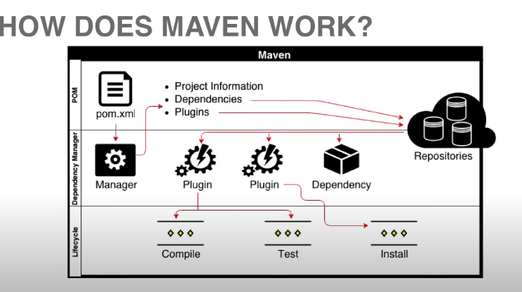
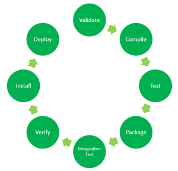

# MAVEN

# What is Maven?

- **Maven is a build tool**

  These tools take the source code and generate some sort of library. They pack out code into a kind of distributable library.

- **Dependency management tool**

  We build applications that rely on third part libraries. With maven we change the way we obtain those dependencies and the way we manage them.

- Project management tool
- Standarized approach to build software
- Command line tool
- IDE integration

## Build tools

- Create deployable artifacts from source code
- Automated/repetable builds
- Deploying artifacts on servers
- IDE independence
- Integration with other build toold

## Dependency Management

- Download project dependencies from centralized repositories
- Automatically resolve the libraries by project dependencies
- Dependency scoping: conditionally include certain dependencies

## Project Management

- Artifact versioning
- Change logs
- Documentation
- Javadocs
- Reports

## Standarized software builds

- Uniformity across projects through patterns: standard directory patterns
- Convention over configuration
- Consistent path for all projects
- Philosophy of maven: standarize apache projects structure

# Maven Landscape

## Project Object Model (POM)

- Describes, configures and customizes a Maven Project
- Maven reads the pom.xml file to build a project
- Defines the "address" for the project artifact using a coordinate system
  - artifactId
  - groupId
  - version
- Specifies project information, plugins, goals, dependencies and profiles
- The Super POM is Maven's default POM. All POMs extend the Super POM unless explicitly set, meaning the configuration specified in the Super POM is inherited by the POMs you created for your projects.

## Repositories

- Holds build artifacts and dependencies of varying types
- Local repositories (local cache)
- Remote repositories
- Local repository takes precedence during dependency resolution

## Plugin And Goals

- Plugin is a collection of goals
- Example: compiler plugin
- Goals performs the actions in Maven builds
- All work is donde via plugins and goals
- Called independently or as part of a lifecycle phase
- We can thinks goals as methods, actions that we can execute to perform our maven builds

## Lifecycle and Phases

- Lifecycle is a sequence of named phases
- Phases are executed sequentially
- 3 lifecycles: clean, default, site
- Executing a phase executes all previous phases

# Maven Technical Overview



# Maven Standard Directory Layout

Having a common directory layout allows users familiar with one Maven project to immediately feel at home in another Maven project. The advantages are analogous to adopting a site-wide look-and-feel.

Try to conform to this structure as much as possible. However, if you can't, these settings can be overridden via the project descriptor.


At the top level, files descriptive of the project: a pom.xml file. In addition, there are textual documents meant for the user to be able to read immediately on receiving the source: README.txt, LICENSE.txt, etc.

There are just two subdirectories of this structure: src and target. The only other directories that would be expected here are metadata like CVS, .git or .svn, and any subprojects in a multiproject build (each of which would be laid out as above).

- The target directory is used to house all output of the build.
- The src directory contains all of the source material for building the project, its site and so on. It contains a subdirectory for each type: main for the main build artifact, test for the unit test code and resources, site and so on.

  Within artifact producing source directories (ie. main and test), there is one directory for the language java (under which the normal package hierarchy exists), and one for resources (the structure which is copied to the target classpath given the default resource definition).

# Maven lifecyle and basic maven commands

## Default maven lifecycle



Consists of 8 major steps or phases for compiling, testing, building and installing a given java project as specifies below:

- **Validate:** This step validates if the the project structure is correct. For examples: it checks if all the dependencies have been downloaded and are available in the local repository.

- **Compile:** It compiles the source code ans stores the classes in the target/classes directory

- **Test:** It runs unit tests for the priject.

- **Package:** This step packages the compiled code in a distributable format like JAR or WAR.

- **Integration Tests:** It runs the integration tests for the project

- **Verify:** This step runs checks to verify that the project is valid and meets quality standards.

- **Install:** This step installs the packaged code in the local maven repository.

- **Deploy:** It shares the packaged code to the remote repository for sharing it with other developers.

However, even though a build phase is responsible for a specific step in the build lifecycle, the manner in which it carries out those responsibilities may vary. And this is done by declaring the plugin goals bound to those build phases.

A plugin goal represents a specific task (finer than a build phase) which contributes to the building and managing of a project. It may be bound to zero or more build phases. 

## Maven Commands:

- **mvn clean** cleans the project and removes all files generated by the previous build
- **mvn compile** compiles source code of the project
- **mvn test-compile** compiles the test source code
- **mvn test** runs tests for the project
- **mvn package** creates JAR ow WAR file for the project to convert it into a distributable format
- **mvn install** deploys the packaged JAR/WAR file to the local repository
- **mvn site** generate the project documentation
- **mvn validate** validate the project's POM and configuration
- **mvn idea:idea** generates project files for intellij
- **mvn release:perform** performs a release build
- **mvn deploy** copies the packaged JAR/WAR file to the remote repository
- **mvn arehctype:generate** this command is used to generate a new project from an archetype, which is a template for a project. This command is typically used to create new projects based on a specific pattern or structure
- **mvn dependency:tree** this command is used to display the dependncies of the project in a tree format. This command is typically used to understand the dependencies of the prihect and troubleshoot any issues.

# POM inheritance

The configuration established in the parent POM ois carried over into the child POM. Under the child POM we can override configuration.

Elements in the POM that are merged are the following:

- dependencies
- developers and contributors
- plugin lists (including reports)
- plugin executions with matching ids
- plugin configuration
- resources

The Super POM is one example of project inheritance, however you can also introduce your own parent POMs by specifying the parent element in the POM.

Generally, to specify a specific pom parent, we add a parent tag to the child pom as:

```xml
  <parent>
    <groupId>com.mycompany.app</groupId>
    <artifactId>my-app</artifactId>
    <version>1</version>
  </parent>
```

Notice that we now have an added section, the parent section. This section allows us to specify which artifact is the parent of our POM. And we do so by specifying the fully qualified artifact name of the parent POM. With this setup, our module can now inherit some of the properties of our parent POM.

# Introduction to Build Profiles

Apache Maven goes to great lengths to ensure that builds are portable. Among other things, this means allowing build configuration inside the POM, avoiding all filesystem references (in inheritance, dependencies, and other places), and leaning much more heavily on the local repository to store the metadata needed to make this possible.

However, sometimes portability is not entirely possible. Under certain conditions, plugins may need to be configured with local filesystem paths. Under other circumstances, a slightly different dependency set will be required, and the project's artifact name may need to be adjusted slightly. And at still other times, you may even need to include a whole plugin in the build lifecycle depending on the detected build environment.

To address these circumstances, Maven supports build profiles. Profiles are specified using a subset of the elements available in the POM itself (plus one extra section), and are triggered in any of a variety of ways. They modify the POM at build time, and are meant to be used in complementary sets to give equivalent-but-different parameters for a set of target environments.

A profile can be activated in several ways:

- Explicitly
- Implicitly
  - Based on OS
  - Based on system properties
  - Based on presence of files

# Generate a basic project fast

```bash
mvn archetype:generate
```

# Maven dependencies

Maven simplifies the creation and management of dependencies by using a centralized repository that contains a vast collection of open-source libraries and frameworks.

To define a dependency you need to specify the group ID, artifact ID, and version of the dependency.


The command to sync dependencies is:

```bash
mvn dependency:copy-dependencies
```

## Resolve Dependencies

Once the dependencies are defined in the "pom.xml" file, Maven will automatically download and resolve the dependencies from the central repository. Maven check if the dependency is already downloaded in the local repository, and if not, downloads it from the central repository.

## Repositories

There are exactly two types of repositories: local and remote:

1. the local repository is a directory on the computer where Maven runs. It caches remote downloads and contains temporary build artifacts that you have not yet released.
2. remote repositories refer to any other type of repository, accessed by a variety of protocols such as file:// and https://. These repositories might be a truly remote repository set up by a third party to provide their artifacts for downloading (for example, repo.maven.apache.org). Other "remote" repositories may be internal repositories set up on a file or HTTP server within your company, used to share private artifacts between development teams and for releases.

## Transitive Dependencies

Maven avoids the need to discover and specify the libraries that your own dependencies require by including transitive dependencies automatically.

This feature is facilitated by reading the project files of your dependencies from the remote repositories specified. In general, all dependencies of those projects are used in your project, as are any that the project inherits from its parents, or from its dependencies, and so on.

## Managing Dependencies

Maven provides several goals to manage dependencies. Including adding, removing, and updating dependencies. For example, to update a dependency, you can use the following command:

```bash
mvn versions:use-latest-versions
```

This will update all the project's dependencies to the latest version available in the central repository.

## Dependency Scope

Dependencies in Maven can have different scopes, which determine when and where the dependency is used. The four main scopes are: **compile, provided, runtime and test**. The scope can be specified in the dependency declaration.

The default scope is **compile**.

## Types of dependencies:

In maven there are several types of dependencies that can be defined in the project's "pom.xml" file. These dependencies specify the libraries or frameworks that the project needs to compile, test, or run. The main types of dependencies in maven are:

- **Compile dependencies:** these dependencies are required ofr the project to compile and build correctly. Maven download this dependencies and adds them to the project's classpath. These dependencies are also packaged in the output JAR.

- **Provided dependencies:** These dependencies are required for the project to compile, but they are expected to be provided by the runtime environment. Examples of such dependencies are servlet-api and jsp-api. These dependencies are not packeged in the project's output JAR.

- **Runtime dependencies:** These dependencies are required for the project to run but are not required for the project to compile. These dependencies are added to the claspath at runtime, but they are not packaged in the project's output JAR.

- **Test dependencies:** These dependencies are required for the project's tests but are not required for the project to compile or run. These dependencies are added to the classpath when running tests, bu they are no packaged in the project's output JAR.

- **System dependencies:** These dependencies are not available in the central maven repository and are required to be manually installed on the local machine. To include system dependencies in the project, you must specify the path to the dependency JAR file.

- **Import dependencies:** These dependencies are used to import dependencies from other maven projects. When importing a dependency, maven will use the imported project's "pom.xml" file to download and manage the dependency.

## Dependencies Exclusions

Since Maven resolves dependencies transitively, it is possible for unwanted dependencies to be included in your project's classpath. For example, a certain older jar may have security issues or be incompatible with the Java version you're using. To address this, Maven allows you to exclude specific dependencies. Exclusions are set on a specific dependency in your POM, and are targeted at a specific groupId and artifactId. When you build your project, that artifact will not be added to your project's classpath by way of the dependency in which the exclusion was declared.

To do this we use the following inside the dependencies that have the transitive dependency that we dont want:

```xml
<exclusions>
  <exclusion>  <!-- declare the exclusion here -->
    <groupId>sample.ProjectB</groupId>
    <artifactId>Project-B</artifactId>
  </exclusion>
</exclusions>
```

# Maven plugins

The maven plugins are central part of maven framework, it is used to perform specific goal.

According to apache maven, there are 2 types of maven plugins:

- Build plugins
- Reporting plugins

## Build Plugins

These plugins are executed at the time of build.

## Reporting plugins

These plugins are executed at the time of site generation.

## Core plugins


