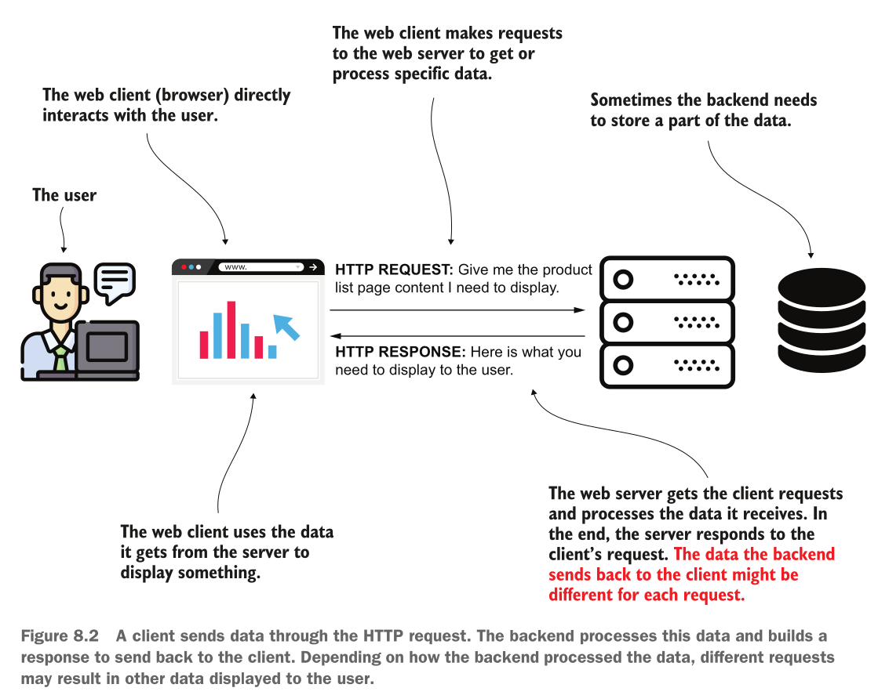

# Implementing web apps with Spring Boot and Spring MVC

## Implementing web apps with a dynamic view

Most apps today need to display dynamic data to the user. Now, for a user’s request expressed through an HTTP request sent by the browser, the web app receives some data, processes it, and then sends back an HTTP response that the browser needs to display.



We’ll review the Spring MVC flow and then work on an example to demonstrate how the view can get dynamic values from the controller.

The Spring MVC flow is aas follows:

1. The client sends an HTTP request to the web server.
2. The dispatcher servlet uses the handler mapping to find out what controller action to call.
3. The dispatcher servlet calls the controller’s action.
4. After executing the action associated with the HTTP request, the controller returns the view name the dispatcher servlet needs to render into the HTTP response.
5. The response is sent back to the client.

To make use of dynamic data, we need to change the step 4. We want the controller not only to return the view name but somehow also send data to the view. The view will incorporate this data to define the HTTP response. This way, if the server sends a list of one product, and the page displays the list, the page will display one product. If the controller sends two products for the same view, now the displayed data will be different because the page will show two products.

Lets develop a simple example to send data from the controller to the view:

We’ll create a Spring Boot project and add a template engine to the dependencies in the pom.xml file. We’ll use a template engine named *Thymeleaf*. The template engine is a dependency that allows us to easily send data from the controller to the view and display this data in a specific way.

```xml
<dependency>
  <groupId>org.springframework.boot</groupId>
  <artifactId>spring-boot-starter-thymeleaf</artifactId>
</dependency>
```

Next lets see the definition of the controller. We annotate the method to map the action to a specific request path using @RequestMapping. We now also define a parameter to the method. This parameter of type Model
stores the data we want the controller to send to the view. In this Model instance, we add the values we want to send to the view and identify each of them with a unique name (also referred to as key). To add a new value that the controller sends to the view, we call the addAttribute() method. The first parameter of the addAttribute() method is the key; the second parameter is the value you send to the view.

```java
// The @Controller stereotype annotation marks
// this class as Spring MVC controller and adds a
// bean of this type to the Spring context.
@Controller
public class MainController {

    // We assign the controller’s action
    // to an HTTP request path.
    @RequestMapping("/home")
    // The action method defines a parameter of type Model that stores the data the
    // controller sends to the view.
    public String home(Model page) {
        // We add the data we want the controller sends to the view
        page.addAttribute("username", "David");
        page.addAttribute("color", "blue");

        // The controller’s action returns the view
        // to be rendered into the HTTP response.
        return "home.html";
    }
}
```

To define the view, you need to add a new “home.html” file to your Spring Boot project’s “resources/templates” folder.

The first important thing to notice in the file’s content is the \<html> tag where I added the attribute xmlns:th="http://www.thymeleaf.org". This definition is equivalent to an import in Java. It allows us further to use the prefix “th” to refer to specific features provided by Thymeleaf in the view.

A little bit further in the view, you find two places where I used this “th” prefix to refer to the controller’s data to the view. With the \${attribute_key} syntax, you refer to any of the attributes you send from the controller using the Model instance. For example, I used the \${username} to get the value of the “username” attribute and ${color} to get the value of the “color” attribute.

```html
<!DOCTYPE html>
<html lang="en" xmlns:th="http://www.thymeleaf.org">
<head>
    <meta charset="UTF-8">
    <title>Title</title>
</head>
<body>
    <h1>Welcome
        <span th:style="'color:' + ${color}" th:text="${username}"></span>!
    </h1>
</body>
</html>
```

To test if everything works, start the application and access the web page in a browser.

### Getting Data on the HTTP request

In this section, we discuss how the client sends data to the server through HTTP requests. In apps, we often need to give the client the ability to send information to the server. This data gets processed and then displayed on the view.

In most cases, to send data through the HTTP request you use one of the following ways:

- An **HTTP request parameter** represents a simple way to send values from client to server in a key-value(s) pair format. To send HTTP request parameters, you append them to the URI in a request query expression. They are also called query parameters. You should use this approach only for sending a small quantity of data.
- An **HTTP request header** is similar to the request parameters in that the request headers are sent through the HTTP header. The big difference is that they don’t appear in the URI, but you still cannot send large quantities of data using HTTP headers.
- A **path variable** sends data through the request path itself. It is the same as for the request parameter approach: you use a path variable to send a small quantity of data. But we should use path variables when the value you send is mandatory.
- The **HTTP request body** is mainly used to send a larger quantity of data (formatted as a string, but sometimes even binary data such as a file).

### Using request parameters to send data from client to server

You use request parameters in the following scenarios:

- *The quantity of data you send is not large*. You set the request parameters using query variables. This approach limits you to about 2,000 characters.
- *You need to send optional data*. A request parameter is a clean way to deal with a value the client might not send. The server can expect to not get a value for spe- cific request parameters.

To get the value from a request parameter, you need to add one more parameter to the controller’s action method and annotate that parameter with the @RequestParam annotation. The @RequestParam annotation tells Spring it needs to get the value from the HTTP request parameter with the same name as the
method’s parameter name.

```java
@Controller
public class MainController {


    @RequestMapping("/home")
    // We define a new parameter for the controller’s action method and annotate it with @RequestParam.
    public String home(Model page, @RequestParam(required = false) String color) {
        page.addAttribute("username", "David");

        if (color != null) page.addAttribute("color", color);
        else page.addAttribute("color", "blue");

        return "home.html";
    }
}
```

Run the application and access the /home path. To set the request parameter’s value, you need to use the next snippet’s syntax:

`http://localhost:8080/home?color=blue`

When setting HTTP request parameters, you extend the path with a ? symbol followed by pairs of key=value parameters separated by the & symbol.

> A request parameter is mandatory by default. If the client doesn’t provide a value for it, the server sends back a response with the status HTTP “400 Bad Request.” If you wish the value to be optional, you need to explicitly specify this on the annotation using the required attribute: @RequestParam(required=false)

### Using path variables to send data from client to server

Using path variables is also a way of sending data from client to server. But instead of using the HTTP request parameters, you directly set variable values in the path, as presented in the next snippet.

`http://localhost:8080/home/blue`

You don’t identify the value with a key anymore. You just take that value from a precise position in the path. On the server side, you extract that value from the path from the specific position.

You may have more than one value provided as a path variable, but it’s generally better to avoid using more than a couple. You’ll observe that the path becomes more challenging to read if you go with more than two path variables.

Also, you shouldn’t use path variables for optional values.


When the page you write depends on only one or two values that are the core of the end result, it’s better to write them directly in the path to make the request easier to read. The URL is also easier to find when you bookmark it in your browser and easier to index with a search engine

To reference a path variable in the controller’s action, you simply give it a name and add it to the path between curly braces. You then use the @PathVariable annotation to mark the controller’s action parameter to get the path variable’s value.

```java
@Controller
public class MainController {

    // To define a path variable, you assign it
    // a name and put it in the path between
    // curly braces.
    @RequestMapping("/home/{color}")
    // You mark the parameter where you want to get the path variable value
    // with the @PathVariable annotation. The name of the parameter must be
    // the same as the name of the variable in the path.
    public String home(Model page, @PathVariable String color) {
        page.addAttribute("username", "David");
        page.addAttribute("color", color);
        return "home.html";
    }
}
```

## Using the GET and POST HTTP methods

In this section, we discuss HTTP methods and how the client uses them to express what action (create, change, retrieve, delete) it will apply to the requested resource. **A path and a verb identify an HTTP request.** For example, by using GET, we represent an action that only retrieves data. It’s a way for the client to say it wants to obtain something from the server, but the call won’t change data. But you’ll need more than this. An app also needs to change, add, or delete data.

We’ve relied on the request path to reach a specific action of the controller, but in a more complex scenario you can assign the same path to multiple actions of the controller as long as you use different HTTP methods. We’ll work on an example to apply such a case.


